# usp_agregar_ventas

## Descripción general

El **SP** usp_agregar_ventas tiene como objetivo registrar una venta en el sistema, mediante validaciones sobre el cliente, producto y existencia en inventario.

Este procedimiento realiza operaciones en las siguientes tablas:

* CatCliente -> Verificación del cliente
* CatProducto -> Validación de existencia y obtención de 
* precio
* TBLVenta -> Registro de la venta
* TBLDetalleVenta -> Registro del detalle de la venta

## Lógica del procedimiento

El procedimiento sigue una secuencia lógica como la de una tienda de chocolates:

1. Verificación del cliente (en una tienda hay que verificar si hay algun cliente o alucinas)

Se valida que el cliente exista en la tabla CatCliente.

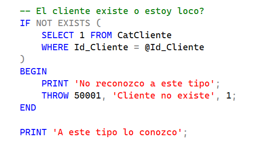

2. Verificación del producto (Hay que ver si tenemos el chocolate que quiere el cliente)

Se valida que el producto exista en la tabla CatProducto.

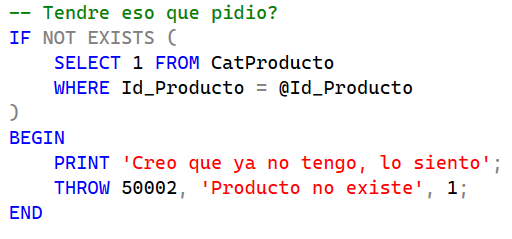

3. Validación de existencia (Hay que ver si aun hay de eso chocolates)

Se obtiene el precio y la existencia del producto:

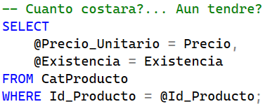

Se valida que haya suficiente inventario:

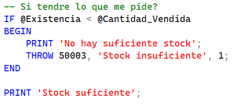

**Si cualquiera de estas comprobaciones falla Se lanza un error con THROW y se cancela la operación**

4. Registro de la venta (Hay que registrar esto en el sistema)

Se inserta la venta en la tabla TBLVenta:

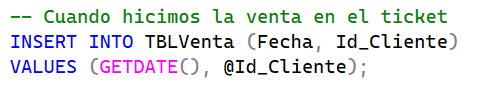

Obtención del ID de venta


Este valor se utiliza para relacionar el detalle de la venta.

5. Registro del detalle de venta (Imprimir el recibo)

Se inserta el producto vendido:

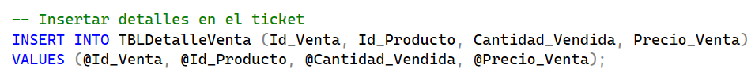

6. Actualización de inventario (Hay que actualizar nuestros almacenes)

Se descuenta la cantidad vendida:

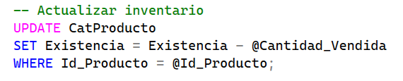

7. Manejo de transacciones

El procedimiento utiliza una transacción para garantizar consistencia:

```
BEGIN TRANSACTION
COMMIT
ROLLBACK
```

Si todo sale bien -> COMMIT
Si ocurre un error -> ROLLBACK

8. Manejo de errores

Se puso un bloque TRY...CATCH:

```
BEGIN TRY
BEGIN CATCH
```

Dentro del CATCH:

Se revierte la transacción
Se muestran mensajes de error:
```
ERROR_MESSAGE()
ERROR_LINE()
```
9. Ejecución del procedimiento

Ejemplo de uso:

```
EXEC usp_agregar_ventas
@Id_Cliente = 'ANATR', 
@Id_Producto = 4, 
@Cantidad_Vendida = 5;
```
10. Resultado esperado

Si todo es correcto:

* Se registra una venta en TBLV enta
* Se registra el detalle en TBLDetalleVenta
* Se actualiza el inventario en CatProducto
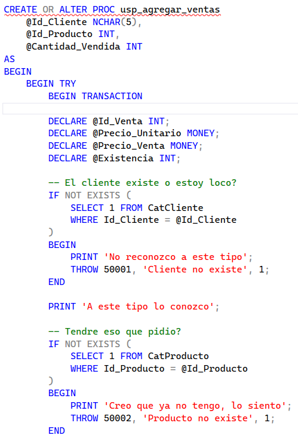
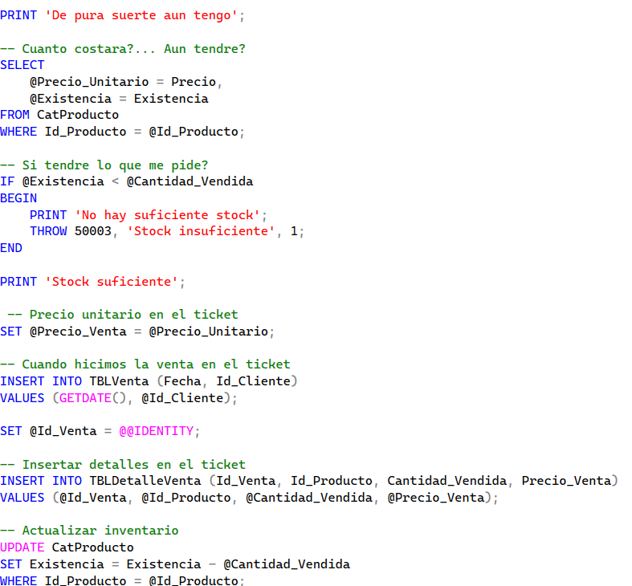
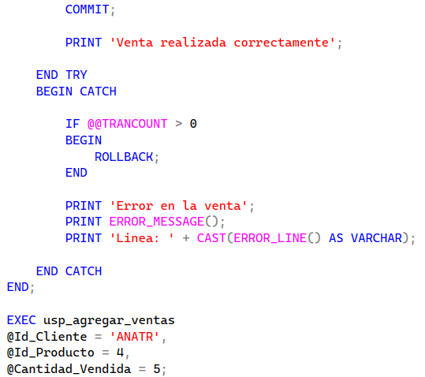
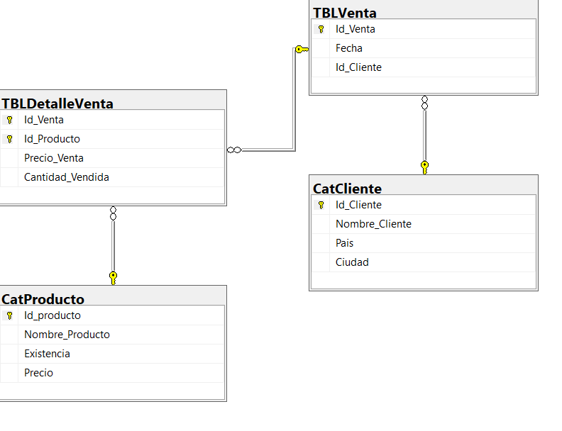


## Conclusión

El procedimiento usp_agregar_ventas asegura:

* Validación de datos
* Control de inventario
* Manejo de errores

Esto garantiza que el sistema sea confiable y evita registros incorrectos en la base de datos.