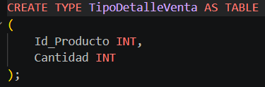
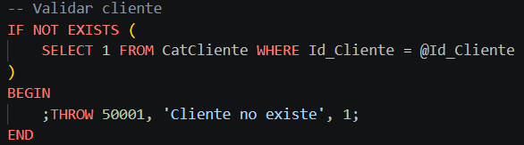
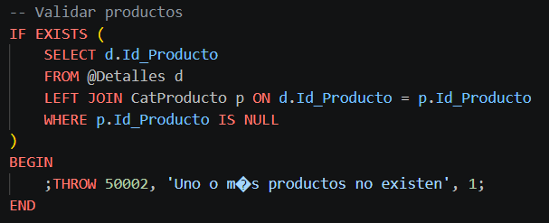
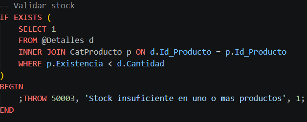
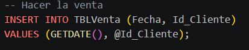
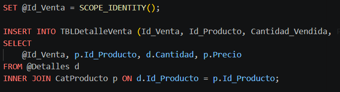
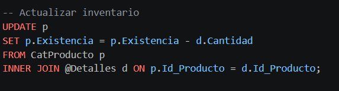
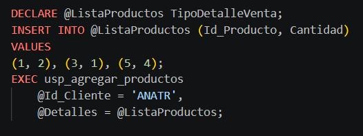

# SP ventas con múltiples productos

## Almacena los productos disponibles.

* Campo	Tipo	**Descripción**
* Id_Producto	**INT**	Identificador del producto
* Nombre_Producto	**NVARCHAR**	Nombre del producto
* Existencia	**INT**	Cantidad disponible
* Precio	**MONEY**	Precio unitario

# Tabla type

## Propósito:

Permitir enviar múltiples productos al procedimiento almacenado.

**Parámetros del procedimiento**

Parámetro	Tipo	Descripción
* @Id_Cliente	NCHAR(5)	Cliente que realiza la compra
* @Detalles	TipoDetalleVenta	Lista de productos y cantidades

# Lógica del procedimiento

## Validación de cliente

Se verifica que el cliente exista en la base de datos.

## Validación de productos (LEFT JOIN)

Se usa LEFT JOIN para detectar productos inexistentes:

Si algún producto no existe se genera error

## Validación de stock (INNER JOIN)

Se usa INNER JOIN para trabajar solo con productos válidos:

Si no hay suficiente stock  se cancela la operación

## Registro de venta

Se inserta un registro en TBLVenta.

## Registro de detalles (INNER JOIN)

Se insertan los productos vendidos junto con su precio.

## Actualización de inventario

Se descuenta la cantidad vendida del stock disponible.

## Control para la transacción

Se usa:

* BEGIN TRANSACTION
* COMMIT
* ROLLBACK en caso de error
### Uso de JOINs
* LEFT JOIN	Detectar productos inexistentes
* INNER JOIN	Validar stock, insertar datos y actualizar inventario

## Ejemplo de ejecución

El procedimiento utiliza:

* TRY...CATCH
* THROW
* ROLLBACK

# FIN
