    # Guía Completa: Instalación de SQL Server 2022 y SSMS

    Este manual documenta el proceso paso a paso para desplegar un entorno de base de datos local, incluyendo el motor de base de datos (SQL Server 2022) y la herramienta de administración (SSMS).

    ---

    ## Parte 1: Motor de Base de Datos (Database Engine)

    ### 1. Descarga del Medio de Instalación
    Se inició el proceso ejecutando el instalador web (`SQL2022-SSEI-Dev`) con privilegios de administrador.

    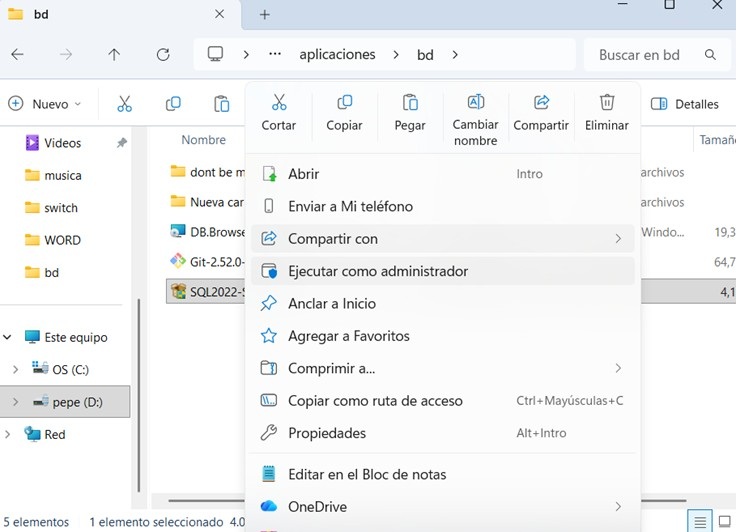

    Se seleccionó la opción **"Descargar medios" (Download Media)** para bajar el archivo ISO completo, permitiendo una instalación *offline* posterior.

    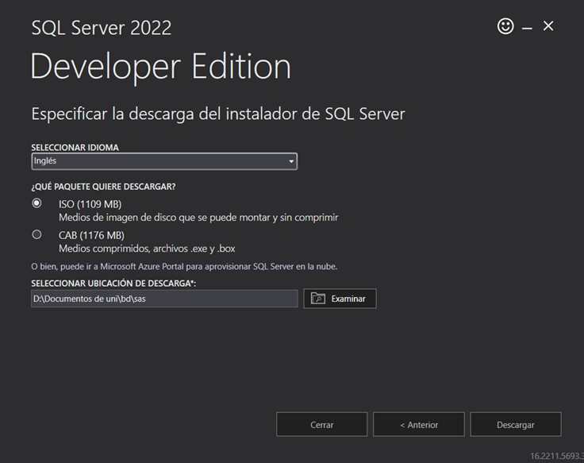
    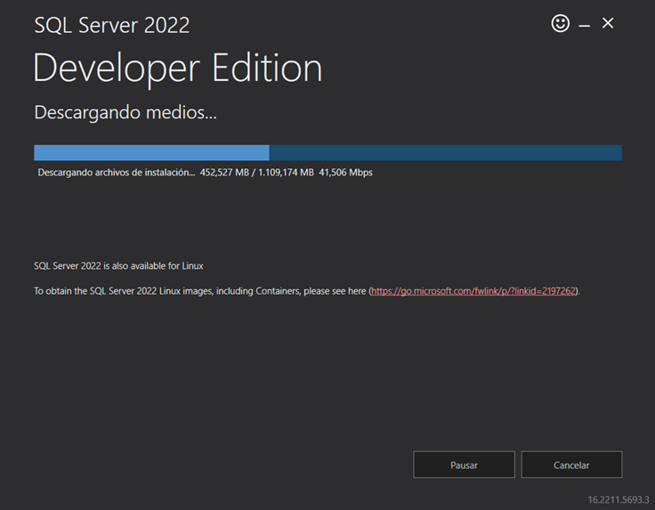
    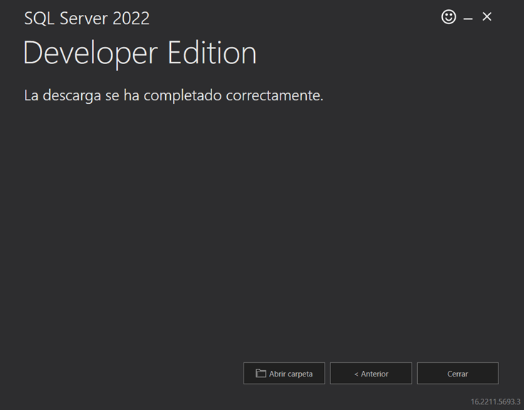

    ### 2. Montaje y Preparación
    Una vez descargada la imagen de disco (`SQLServer2022-x64-ENU-Dev`), se montó en el sistema como una unidad virtual.

    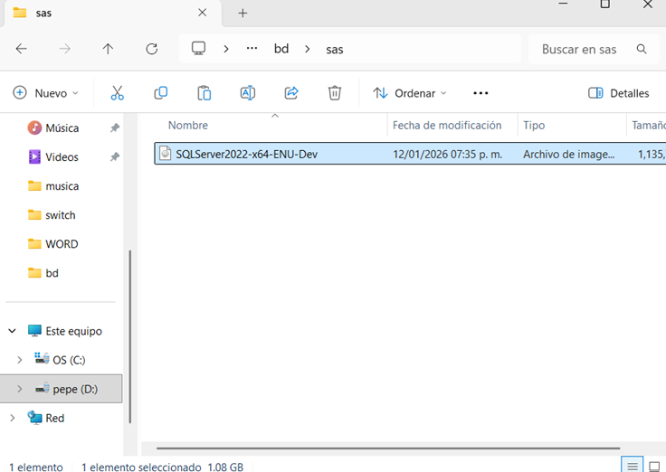
    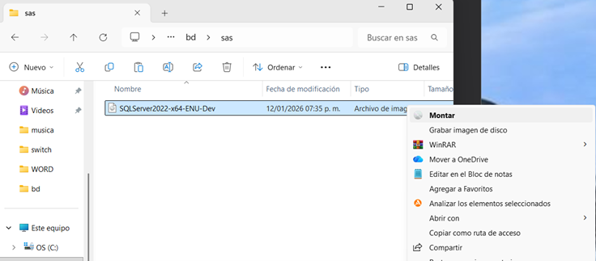

    Dentro de la unidad, se ejecutó `setup.exe` como administrador para lanzar el Centro de Instalación.

    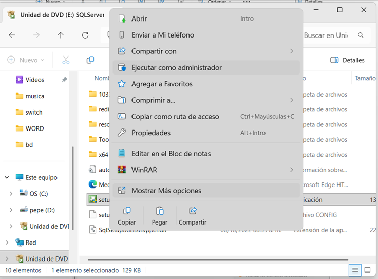
    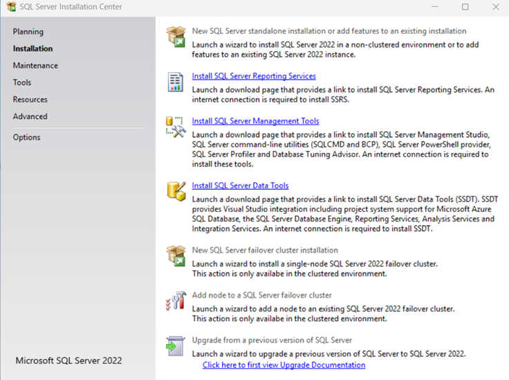

    ### 3. Configuración Inicial
    * **Edición:** Se eligió "Developer Edition" (gratuita para desarrollo).
    * **Licencia:** Se aceptaron los términos del software.
    * **Azure:** Se deshabilitó la extensión de Azure para mantener la instalación puramente local.

    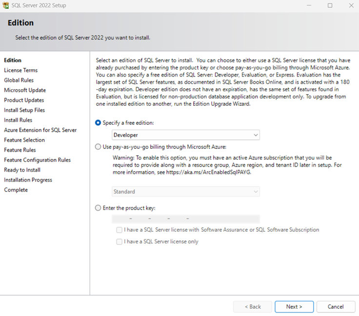
    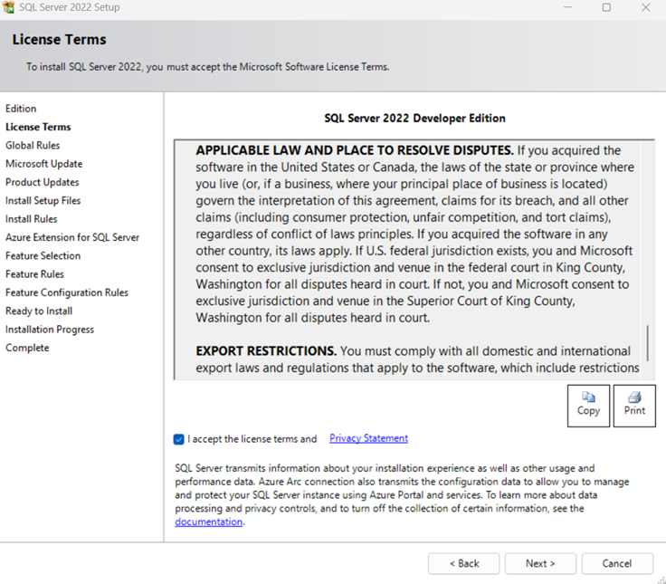
    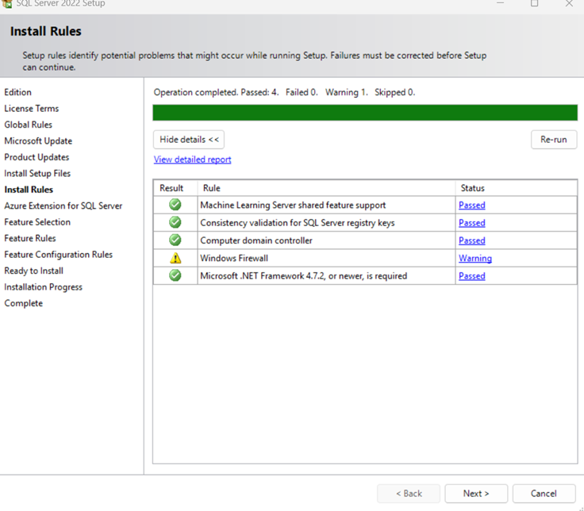
    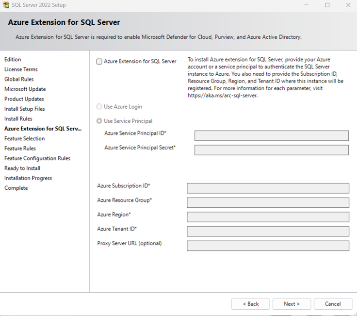

    ### 4. Selección de Características e Instancia
    Se seleccionaron los componentes **Database Engine Services** y **SQL Server Replication**. Se configuró la instancia con el nombre predeterminado `MSSQLSERVER`.

    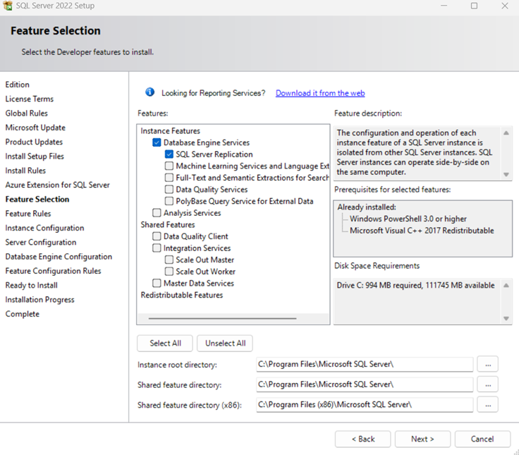
    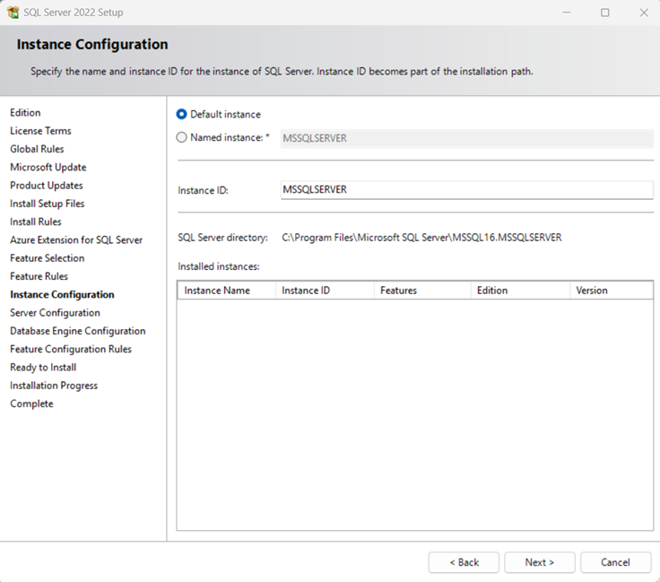

    ### 5. Configuración del Motor (Seguridad)
    Se configuró el modo de autenticación **Mixto** (Mixed Mode):
    1.  Se asignó una contraseña para el usuario `sa`.
    2.  Se agregó al usuario actual de Windows como administrador (`Add Current User`).

    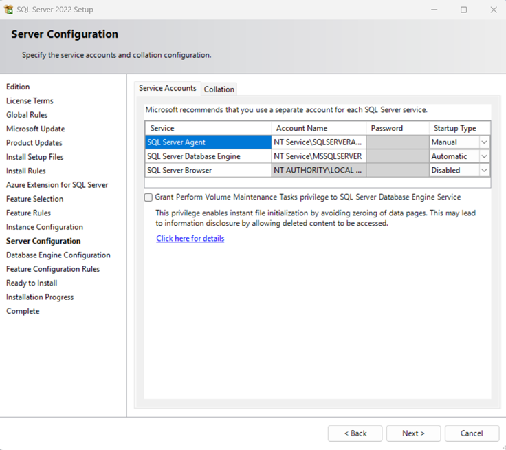
    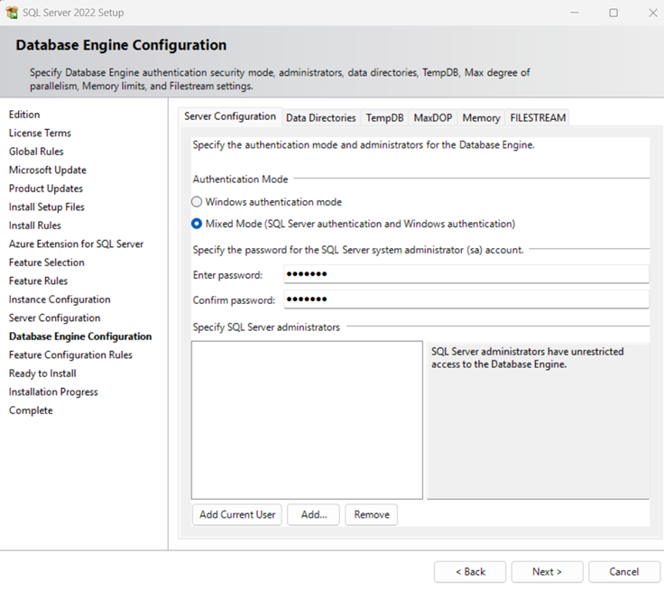
    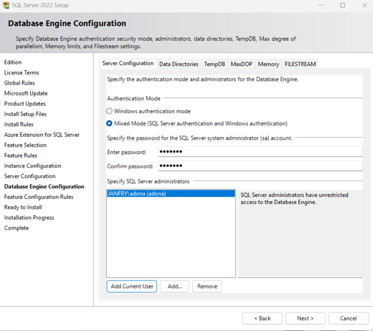

    ### 6. Instalación Exitosa
    Tras revisar el resumen, se procedió con la instalación, la cual finalizó correctamente para todos los servicios.

    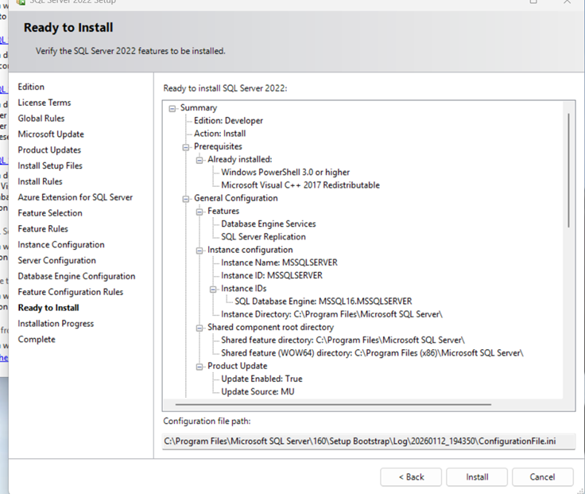
    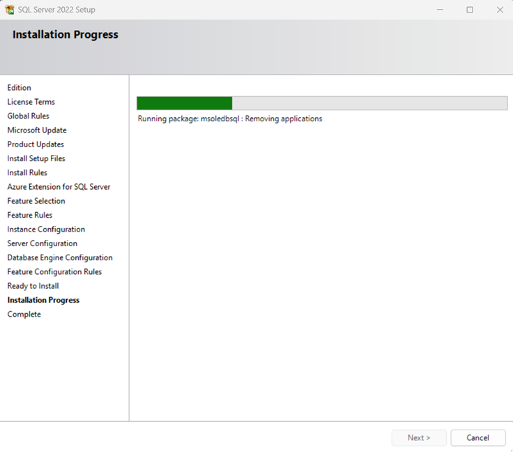
    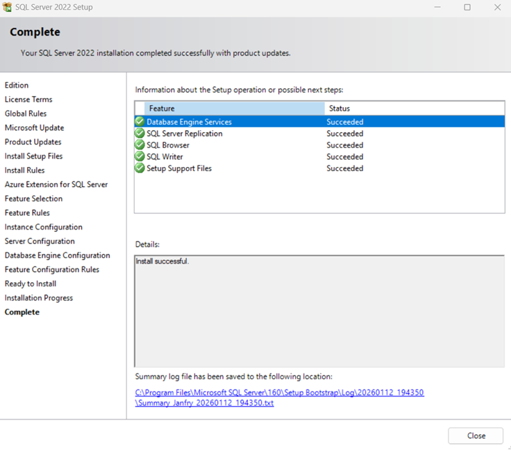

    ---

    ## Parte 2: SQL Server Management Studio (SSMS)

    Para administrar la base de datos, se procedió a instalar la interfaz gráfica.

    ### 1. Obtención del Instalador
    Desde la documentación oficial de Microsoft, se descargó el instalador para **SSMS 22**.

    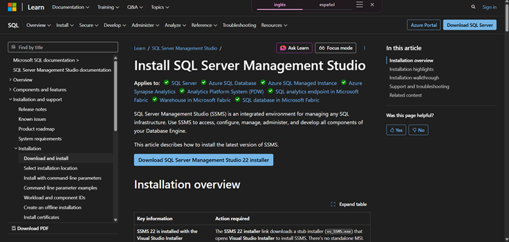

    ### 2. Ejecución mediante Visual Studio Installer
    Se ejecutó el instalador `vs_SSMS` con permisos de administrador. En esta versión, la instalación se gestiona a través del *Visual Studio Installer*.

    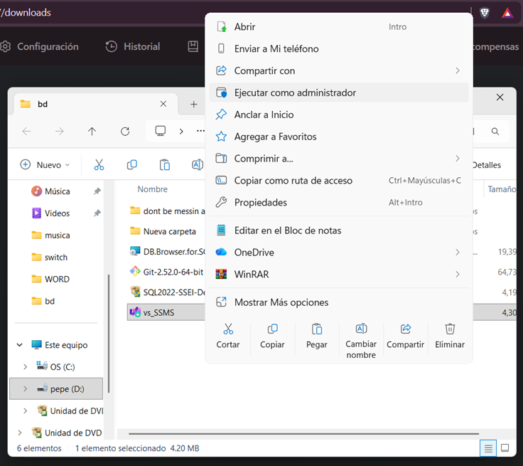
    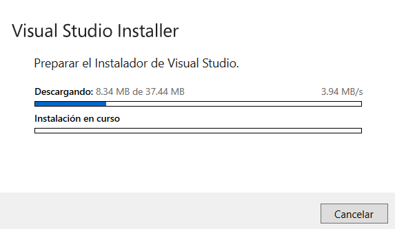

    Se confirmó la instalación de **SQL Server Management Studio 22** desde la interfaz del instalador.

    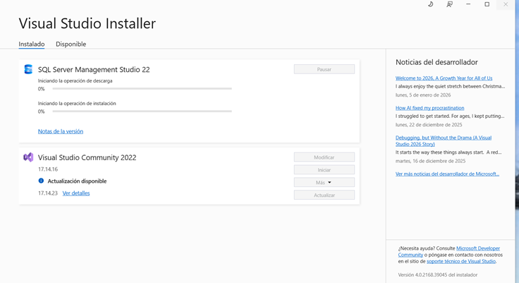

    ---

    ## Parte 3: Verificación de Conexión

    Finalmente, se abrió la herramienta de conexión para validar el acceso a la instancia `MSSQLSERVER` recién creada.

    